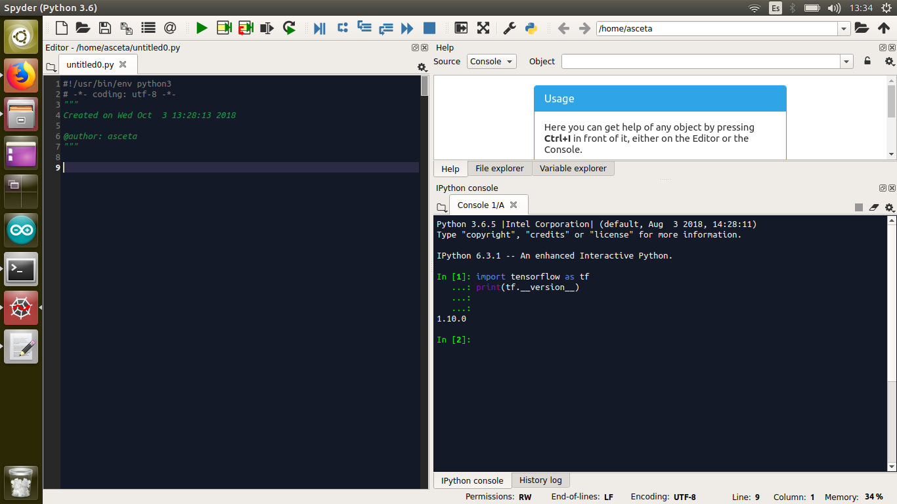

# Example Repository of tarea0

A README.md is like the cover page of our code, like the presentation of our project that invite the visitor to use it.

We can do many thing, just like in a jupyter notebook:

1. Enumerate thing
2. Put some links [heatmapping.org](http://heatmapping.org)
3. Etc.

If you want you can put some code:

	trainer = net.fit(output=score, ground_truth=y_, opt_params=learning_rate)

Or show images:

But remember you should **avoid** putting images in your repo, because they are too heavy, limit your self to have them only for your README.md

